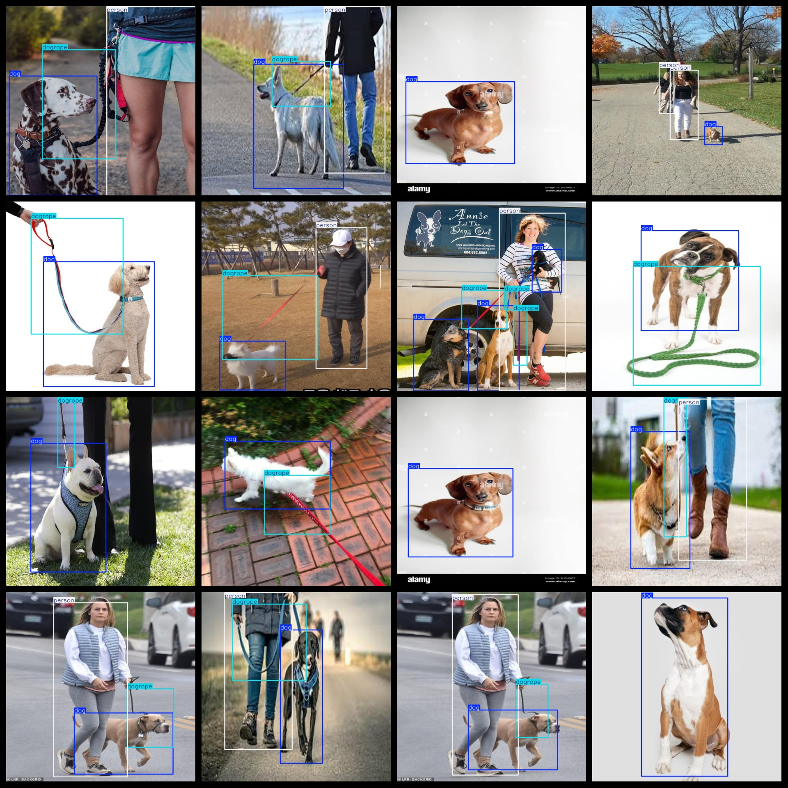
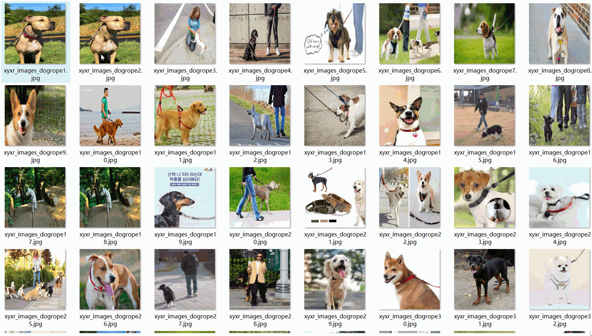

# Walking Dog Do not pull the rope Dataset 1047 images VOC+YOLO format

The dataset consists of 1047 images in VOC+YOLO format, organized into three folders for storing images, XML files, and text files. The JPEGImages folder contains a total of 1047 jpg images. The Annotations folder has 1047 xml files, while the labels folder contains 1047 text files. There are a total of 3 label categories: "dog", "dogrope", and "person". The number of bounding boxes (yolo format) for each category is as follows:

- Dog: 1464 bounding boxes
- Dogrope: 890 bounding boxes
- Person: 646 bounding boxes

Total bounding box count: 3000

The image resolution is clear with a resolution of pixels. The images have not been enhanced. The repository location for this dataset is datasets_sl. The shape of the labels is rectangular bounding boxes, which are used for target detection recognition. 

This dataset does not guarantee the accuracy or precision of any trained models or weight files. It only provides accurate and reasonable annotations. The details of the annotations and images are as follows:

## Images

---

Here is a pay link on Stripe (https://buy.stripe.com/3cs8yP7sY87d0vu9AB). Please contact me lonlonago@foxmail.com after funding $89, and I will send you a complete data files, thank you!

